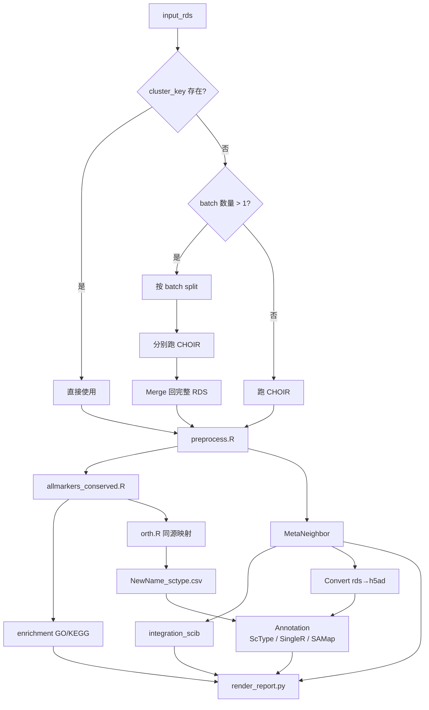

# Phytoscope — 项目设计文档

> **植物单细胞自动化注释流水线** — let plant cell annotation more easy!
> 让生信人员跑得动、让生物学家看得懂。

---

## 目录

1. [项目哲学](#1-项目哲学)
2. [整体架构](#2-整体架构)
3. [Data 模块 — 参数配置与数据准备](#3-data-模块--参数配置与数据准备)
4. [Computation 模块 — 流水线计算](#4-computation-模块--流水线计算)
5. [Interpretation 模块 — AI 辅助解读](#5-interpretation-模块--ai-辅助解读)
6. [前端设计（单 HTML 双模式）](#6-前端设计单-html-双模式)
7. [多注释一致性投票算法](#7-多注释一致性投票算法)
8. [文件结构与交付物](#8-文件结构与交付物)
9. [运行流程](#9-运行流程)
10. [TODO 与里程碑](#10-todo-与里程碑)

---

## 1. 项目哲学

### 三大痛点

| 痛点 | 表现 | 对策 |
| --- | --- | --- |
| **难注释** | 植物非模式物种缺少高质量细胞类型 marker 基因 | 多证据（marker/enrich/同源）多方法（ScType/SingleR/SAMap）交叉验证 |
| **难对齐** | 多样本间细胞类型/状态存在差异 | MetaNeighbor AUC 评估 + 多方法整合 + scIB 量化评估 |
| **难解读** | 结果散落在各脚本输出中，缺乏统一视图 | 单文件 HTML 报告 + AI 辅助结论生成 |

### 三层哲学

```
┌─────────────────────────────────────────────────────┐
│  📦 Data          ⚙️ Computation      🔍 Interpretation │
│  (我们用了什么)    (我们做了什么)       (这意味着什么)   │
└─────────────────────────────────────────────────────┘
```

这三层不仅是导航结构，也对应了**读者从浅入深的认知路径**：
- **Data** → 任何读者都能理解实验背景
- **Computation** → 生信人员验证分析质量
- **Interpretation** → 生物学家获取生物学结论

---

## 2. 整体架构

```text
┌───────────────────────────────────────────────────────────────┐
│                        用户输入层                                │
│  ├─ 项目信息（物种/组织/背景）                                     │
│  ├─ 参数配置（input_rds, marker_csv, batch_key...）               │
│  ├─ API Key（Kimi，用于 AI 解读）                                 │
│  └─ 导出为 CSV / JSON                                           │
├───────────────────────────────────────────────────────────────┤
│                        计算流水线层                               │
│  ├─ Stage 1: CHOIR 聚类                                         │
│  ├─ Stage 2: Preprocess + AllMarkers                           │
│  ├─ Stage 3: Enrichment (GO/KEGG)                              │
│  ├─ Stage 4: MetaNeighbor (批次对齐)                              │
│  ├─ Stage 5: Integration + scIB (多方法整合评估)                    │
│  └─ Stage 6: Annotation (ScType / SingleR / SAMap) + Ortholog  │
├───────────────────────────────────────────────────────────────┤
│                        报告生成层                                 │
│  ├─ render_report.py → 收集各模块 JSON + CSV → 渲染 Jinja2 模板    │
│  ├─ 输出单文件 HTML（CDN 静态资源，零服务器依赖）                     │
│  └─ HTML 内置两种模式：编辑模式 + 报告模式                           │
├───────────────────────────────────────────────────────────────┤
│                        AI 解读层（前端实时调用）                      │
│  ├─ Kimi API（用户 Key 存 localStorage）                          │
│  ├─ Consensus → 投票算法输出置信度表格                              │
│  └─ Conclusion → 基于共识结果 + 证据拼接 prompt → AI 生成文本      │
└───────────────────────────────────────────────────────────────┘
```

---

## 3. Data 模块 — 参数配置与数据准备

### 3.1 项目信息表单

用户在 **编辑模式** 下填写以下信息：

| 字段 | 类型 | 必需 | 示例 | 说明 |
| --- | --- | :---: | --- | --- |
| `genus` | text | ✅ | `Sedum` | 属名 |
| `species` | text | ✅ | `plumbizincicola` | 种名 |
| `tissue` | text | ✅ | `shoot` | 组织 |
| `background` | textarea | ❌ | 伴矿景天是一种超富集锌镉的景天科植物... | 项目背景（供 AI 系统提示词使用） |
| `cell_types_expected` | text | ❌ | `Xylem, Phloem, Mesophyll, Epidermis` | 期望注释的细胞类型 |
| `biological_question` | textarea | ❌ | 重金属胁迫下哪些细胞类型响应最显著？ | 关注的科学问题 |
| `available_resources` | textarea | ❌ | 已有拟南芥 shoot atlas 参考数据... | 可用资源描述 |

### 3.2 运行参数表单

| 字段 | 类型 | 必需 | 默认值 | 说明 |
| --- | --- | :---: | --- | --- |
| `input_rds` | file path | ✅ | — | 输入 Seurat RDS 路径 |
| `marker_csv` | file path | ❌ | — | 细胞类型 marker 基因 CSV（格式参考 `jintian-marker2.csv`） |
| `query_pep` | file path | ❌ | — | 查询物种的蛋白序列（供 diamond blastp 同源映射） |
| `ref_rds` | file path | ❌ | — | 参考物种的 Seurat RDS（供 SingleR） |
| `ref_pep` | file path | ❌ | — | 参考物种蛋白序列（供 orth.R 同源映射） |
| `batch_key` | text | ❌ | `biosample` | Seurat meta.data 中的批次列名 |
| `sample_key` | text | ❌ | `sample` | Seurat meta.data 中的样本列名 |
| `cluster_key` | text | ❌ | — | 已存在的聚类列名（若为空则运行 CHOIR） |
| `kimi_api_key` | password | ❌ | — | Kimi API Key，保存到 localStorage |
| `kimi_model` | select | ❌ | `moonshot-v1-8k` | Kimi 模型版本 |

### 3.3 导出格式

填写完成后可导出为 **JSON**（兼容性更好）或 **CSV**（易于查看），内容示例：

```json
{
  "project": {
    "genus": "Sedum",
    "species": "plumbizincicola",
    "tissue": "shoot",
    "background": "伴矿景天是一种超富集锌镉的景天科植物..."
  },
  "params": {
    "input_rds": "/data/work/Integration/Sp_BBKNNR_integrated.rds",
    "marker_csv": "/data/work/Feature/marker/jintian-marker2.csv",
    "batch_key": "biosample",
    "cluster_key": "metaneighbor"
  },
  "api": {
    "provider": "kimi",
    "model": "moonshot-v1-8k"
  }
}
```

导出的 JSON/CSV 可作为 Makefile 的输入变量来源，驱动整个流水线。

---

## 4. Computation 模块 — 流水线计算

### 4.1 整体流程



### 4.2 各阶段详细说明

#### Stage 1: CHOIR 聚类 (`src/cluster/choir.R`)

- **输入**: `input_rds`
- **逻辑**:
  1. 检查 `cluster_key` 是否存在于 `seu@meta.data`
  2. 若存在 → 跳过，直接使用
  3. 若不存在 → 检查 `unique(seu$batch_key)` 数量
     - 1个 batch → 直接跑 CHOIR
     - 多个 batch → split 后分别跑 CHOIR，再 merge
- **输出**: 添加了 CHOIR 聚类标签的 RDS

#### Stage 2: Preprocess + AllMarkers (`src/utils/seurat/`)

- **preprocess.R**: 标准化、HVG 选择、PCA、UMAP
- **allmarkers_conserved.R**: FindAllMarkers + FindConservedMarkers
- **输出**:
  - `conserved_markers_{cluster_key}.rds.csv` — cluster 特异 marker 基因
  - 预处理后的 RDS

#### Stage 3: Enrichment (`src/anno/enrich/`)

- **run_clusterprofiler.R**: GO/KEGG 富集分析
- **输入**: cluster marker 基因列表
- **输出**: 富集结果表格 + 气泡图

#### Stage 4: MetaNeighbor (`src/metaneighbor/`)

- **输入**: 预处理后的 RDS
- **功能**: 计算批次间细胞群的 AUC 相似度，基于层次聚类统一标签
- **输出**: 添加 `metaneighbor` 标签的 RDS

#### Stage 5: Integration + scIB (`src/integration_scib/`)

- **输入**: MetaNeighbor 输出的 RDS（`metaneighbor` 作为 `label_key`）
- **方法**:
  - R: BBKNNR / rliger.INMF / SCTransform.CCA / SCTransform.harmony
  - Python: harmony / scVI / unintegrated baseline
- **评估**: scIB 指标（NMI、ARI、kBET、iLISI、cLISI...）
- **输出**: 各方法整合后的 UMAP + scIB 指标雷达图

#### Stage 6: Annotation (`src/anno/`)

| 方法 | 输入 | 原理 | 输出 |
| --- | --- | --- | --- |
| **ScType** | RDS + `*_sctype.csv` | marker 基因集富集打分 | 每 cluster 的细胞类型标签 |
| **SingleR** | RDS + `ref_rds` | 参考数据集相关性匹配 | 每 cluster 的细胞类型标签 |
| **SAMap** | h5ad + pep | 跨物种同源基因映射对齐 | 跨物种细胞类型对应关系 |

> **同源映射链路**: `orth.R` 使用 diamond blastp 将 marker 基因从参考物种（如拟南芥）映射到目标物种，生成 `*_sctype.csv` 供 ScType 使用。

### 4.3 编排方式：Makefile

使用 Makefile 串联各阶段，用户只需：

```bash
# 1. 配置参数（编辑 config.mk）
make edit-config

# 2. 运行完整流水线
make all

# 3. 只运行部分阶段
make cluster
make annotation

# 4. 生成报告
make report
```

**Makefile 核心结构**（`Makefile`）：

```makefile
include config.mk

# Stage 1: CHOIR
cluster: $(INPUT_RDS)
	Rscript src/cluster/choir.R $(INPUT_RDS) $(RANDOM_SEED)

# Stage 2: Preprocess
preprocess: cluster
	Rscript src/utils/seurat/preprocess.R $(CHOIR_RDS) $(UMAP_NAME)

# Stage 3: AllMarkers
markers: preprocess
	Rscript src/utils/seurat/allmarkers_conserved.R \
		--rds $(PREPROCESSED_RDS) --batch_key $(BATCH_KEY) \
		--cluster_key $(CLUSTER_KEY) --only_pos yes

# ... 后续阶段类似

# 最终：生成报告
report: all
	python src/jinja2/render_report.py \
		--results_dir results \
		--genus $(GENUS) --species $(SPECIES) --tissue $(TISSUE) \
		--output phytoscope_report.html
```

---

## 5. Interpretation 模块 — AI 辅助解读

### 5.1 设计原则

- **Consensus 是确定性的**：投票算法完全由代码计算，不依赖 AI，确保可复现
- **Conclusion 是 AI 增强的**：将 Consensus 结果 + marker 证据 + 富集结果拼成 prompt，调用 Kimi API 生成叙述文本
- **AI 是可选的**：即使不配置 API Key，报告也能正常显示 Consensus 表格和图表

### 5.2 Consensus 算法（详见第 7 节）

输入三方法的注释结果，输出每个 cluster 的：

| 字段 | 说明 |
| --- | --- |
| `cluster` | 分群编号 |
| `final_label` | 最终确定的细胞类型 |
| `confidence` | `high` / `medium` / `low` |
| `method_votes` | `{ScType: "Xylem", SingleR: "Xylem", SAMap: "Phloem"}` |
| `score` | 加权置信度分数 (0-1) |
| `marker_genes` | 支持该结论的 top marker 基因 |

### 5.3 Conclusion — AI 解读

**流程**：

```text
用户点击 "💡 AI 解读" 按钮
    ↓
前端从 localStorage 读取 Kimi API Key
    ↓
拼接系统提示词 + 证据数据为 prompt
    ↓
调用 Kimi API (moonshot-v1-8k)
    ↓
流式渲染生成的结论文本
    ↓
用户可手动修改、重新生成、或导出
```

**系统提示词模板**：

```
你是一个植物单细胞生物学专家。以下是一个 {species} ({genus}) {tissue} 组织的
单细胞转录组注释结果。

## 项目背景
{background}

## 细胞类型注释结果
{consensus_table 的 Markdown 格式}

## 各 cluster 的 marker 基因
{top_markers 的 Markdown 格式}

## GO/KEGG 富集结果摘要
{enrichment_summary}

请完成以下任务：
1. 描述该组织的细胞类型图谱，解释每种细胞类型的特征 marker 基因
2. 指出注释结果中哪些 cluster 的细胞类型是可靠的（置信度高），
   哪些需要进一步验证（置信度低）
3. 结合项目背景讨论这些细胞类型在生物学问题中的意义
4. 如果有与已知文献不一致的地方，请指出可能的原因
```

> Kimi API 文档参考：https://platform.moonshot.cn/docs

### 5.4 图片解读（未来扩展）

对于 UMAP 图、热图等可视化内容，后续可扩展为：
1. 图表使用 Plotly.js 渲染（交互式，自带数据）
2. 点击图表 → 将图表数据（非截图）送入 Kimi 多模态 API 进行解读
3. 目前 Kimi 多模态能力有限，此功能标记为 **远期 P3**

---

## 6. 前端设计（单 HTML 双模式）

### 6.1 双模式架构

一个 HTML 文件包含两种视图，通过按钮切换：

```text
┌─────────────────────────────────────────────────────┐
│  [✏️ 编辑模式]  [📖 报告模式]  [📤 导出]  [⚙️ 设置]    │
├─────────────────────────────────────────────────────┤
│                                                       │
│  编辑模式 ↓                   报告模式 ↓                │
│  ┌──────────────────┐        ┌──────────────────┐    │
│  │ 📋 项目信息表单    │        │ 📦 Data ▼         │    │
│  │ 物种: [______]    │   ←→   │ 📊 Overview       │    │
│  │ 组织: [______]    │        │ 🧬 Markers        │    │
│  │ 背景: [______]    │        │ 📈 Reference      │    │
│  │ ...              │        │ ⚙️ Computation ▼  │    │
│  │ 🔑 API Key: [__] │        │ 🔬 Clustering     │    │
│  │                  │        │ ...               │    │
│  │ [💾 导出 JSON]   │        │ 🔍 Interpretation │    │
│  │ [▶ 运行流水线]   │        │ 🎯 Consensus      │    │
│  └──────────────────┘        │ 💡 Conclusion     │    │
│                               └──────────────────┘    │
└─────────────────────────────────────────────────────┘
```

### 6.2 技术栈

| 层面 | 选择 | 来源 |
| --- | --- | --- |
| 模板引擎 | Jinja2 (Python) + 原生 JS | 渲染时生成 |
| CSS 框架 | Bootstrap 5 | CDN |
| 图表 | Plotly.js | CDN |
| 表格 | DataTables.js | CDN |
| 图标 | Font Awesome 6 | CDN |
| Markdown 渲染 | marked.js | CDN |
| API 调用 | fetch + 流式读取 (ReadableStream) | 原生 JS |

### 6.3 导航结构（报告模式）

```
NAVBAR: 📦 Data ▼ | ⚙️ Computation ▼ | 🔍 Interpretation ▼

📦 Data 层（3 Tabs）
├── 📊 Overview:      物种/组织/样本卡片、流水线参数、运行状态
├── 🧬 Markers:       marker 基因集来源、基因数量统计
└── 📈 Reference:     参考数据集、同源映射统计（diamond blastp）

⚙️ Computation 层（5 Tabs）
├── 🔬 Clustering:    CHOIR 参数、交互式 UMAP、cluster 统计表
├── 🔗 MetaNeighbor:  AUC 热图、dendrogram、合并前后对比
├── 🧩 Integration:   多方法 UMAP 画廊、scIB 雷达图、方法推荐
├── 🏷️ Annotation:    三方法 UMAP 对比、score 分布、Sankey 图
└── 📈 Enrichment:    GO/KEGG 气泡图、通路详情表

🔍 Interpretation 层（2 Tabs）
├── 🎯 Consensus:     多证据统一注释表 + 置信度 + 最终 UMAP
└── 💡 Conclusion:    AI 生成的生物学故事（可编辑、可重新生成）
```

### 6.4 数据流

```text
render_report.py 运行时：
  results_dir/
  ├── cluster/umap_coords.csv
  ├── cluster/cluster_stats.csv
  ├── markers/allmarkers.csv
  ├── enrichment/go_results.csv
  ├── enrichment/kegg_results.csv
  ├── metaneighbor/auc_heatmap.csv
  ├── integration/scib_metrics.csv
  ├── annotation/sctype_results.csv
  ├── annotation/singler_results.csv
  ├── annotation/samap_results.csv
  └── consensus/final_annotation.csv
       ↓ (读取、校验、转为 JSON)
  Jinja2 模板 + JSON data
       ↓
  单文件 phytoscope_report.html（自包含，无外部依赖）
```

---

## 7. 多注释一致性投票算法

### 7.1 输入

三种方法对每个 cluster 的预测结果：

| 方法 | 对每个 cluster 的输出 | 置信度指标 |
| --- | --- | --- |
| **ScType** | 1 个细胞类型标签 + score | 富集打分 (0-1) |
| **SingleR** | 1 个细胞类型标签 + score | fine-tuning 分数 (0-1) |
| **SAMap** | 1-N 个可能的映射标签 + identity | blast identity (0-100) |

### 7.2 算法流程

```text
对每个 cluster:
  1. 收集三方法的预测标签和置信度分数
  2. 计算同义标签映射（归一化命名，如 "Xylem" == "xylem cell"）
  3. 加权投票：
     - 每种方法的票重 = 该方法的置信度分数
     - 统计每个标签的总权重
  4. 确定 consensus 标签 = 总权重最高的标签
  5. 计算相对置信度：
     - high:   最高权重 ≥ 第二高权重 × 1.5，且最高权重 > 0.5
     - medium: 最高权重 ≥ 第二高权重 × 1.2
     - low:    其他情况
  6. 输出每个 cluster 的 consensus 结果
```

### 7.3 伪代码

```python
def consensus_vote(cluster_id, predictions: dict) -> dict:
    """
    predictions = {
        "ScType":   {"label": "Xylem",   "score": 0.85},
        "SingleR":  {"label": "Xylem",   "score": 0.72},
        "SAMap":    {"label": "Phloem",  "score": 0.45},
    }
    """
    votes = defaultdict(float)
    details = {}
    
    for method, pred in predictions.items():
        label = normalize_label(pred["label"])
        weight = pred["score"]
        votes[label] += weight
        details[method] = {"label": pred["label"], "score": weight}
    
    sorted_votes = sorted(votes.items(), key=lambda x: -x[1])
    top_label, top_weight = sorted_votes[0]
    second_weight = sorted_votes[1][1] if len(sorted_votes) > 1 else 0
    
    # 确定置信度
    if top_weight >= second_weight * 1.5 and top_weight > 0.5:
        confidence = "high"
    elif top_weight >= second_weight * 1.2:
        confidence = "medium"
    else:
        confidence = "low"
    
    return {
        "cluster": cluster_id,
        "final_label": top_label,
        "confidence": confidence,
        "score": round(top_weight / sum(votes.values()), 3),
        "method_votes": details,
    }
```

### 7.4 特殊情况处理

| 场景 | 处理方式 |
| --- | --- |
| 三方法全部一致 | 直接输出 `high` 置信度 |
| 两方法一致，第三种方法不同意 | 采用多数，置信度取决于第三种方法与其他方法的差异度 |
| 三方法全部不一致 | 选用置信度最高的方法，标记为 `low`，在报告中提示需人工审核 |
| 某方法未运行（如缺少参考数据） | 从投票中排除，仅用剩余方法计算 |
| 某 cluster 全部方法置信度都低 | 标记为 `uncertain`，建议做 sub-clustering 后重新注释 |

---

## 8. 文件结构与交付物

### 8.1 源代码结构（现有）

```text
phytoscope/
├── README.md              # 项目简介
├── PROJECT.md             # 本文 — 项目设计文档
├── TODO.md                # 任务跟踪
├── Makefile               # 流水线编排（待建）
├── config.mk              # 用户参数配置（Makefile 的变量文件，待建）
├── data/
│   ├── jintian-marker2.csv   # 示例：跨物种 marker 基因
│   └── ...                   # 其他数据文件
├── doc/
│   └── Sp.md                 # 物种文档
└── src/
    ├── anno/                  # 注释模块
    │   ├── sctype/            # ScType 注释
    │   ├── singler/           # SingleR 注释
    │   ├── SAMap/             # 跨物种 SAMap 注释
    │   └── enrich/            # GO/KEGG 富集
    ├── cluster/               # CHOIR 聚类
    ├── integration_scib/      # 整合 + scIB 评估
    ├── metaneighbor/          # MetaNeighbor 批次对齐
    ├── jinja2/                # 报告模板（核心交付）
    │   ├── README.md
    │   ├── render_report.py
    │   └── templates/
    │       ├── base.html
    │       ├── ... (10 个 Tab 模板)
    │       └── example_data/data_context.json
    └── utils/
        ├── seurat/
        │   ├── preprocess.R
        │   ├── allmarkers_conserved.R
        │   └── orth.R
        ├── convert/           # rds ↔ h5ad（使用 sceasy）
        ├── scanpy/
        │   └── plot_marker.py
        └── align/
            └── diamond_blast.sh
```

### 8.2 新增/待建文件

| 文件 | 优先级 | 说明 |
| --- | :---: | --- |
| `Makefile` | 🔴 P0 | 流水线编排 |
| `config.mk` | 🔴 P0 | Makefile 变量文件（由 HTML 导出的 JSON 生成） |
| `src/jinja2/render_report.py` | 🔴 P0 | 报告渲染脚本 |
| `src/jinja2/templates/*.html` | 🔴 P0 | 10 个 Jinja2 模板 |
| `src/jinja2/templates/example_data/data_context.json` | 🟡 P1 | 各模块输出 JSON 格式定义 |
| `src/utils/convert/convert_rds2h5ad.py` | 🟡 P1 | 基于 sceasy 的格式转换 |
| `src/consensus/vote.py` | 🟡 P1 | 多注释投票算法 |

---

## 9. 运行流程

### 9.1 完整流程

```bash
# 0. 环境配置
cd phytoscope
cp config.example.mk config.mk

# 1. 编辑参数（手动或通过 HTML 编辑模式导出 JSON 后转换）
vim config.mk
# 或: python scripts/json2config.py exported_config.json > config.mk

# 2. 运行流水线
make all

# 3. 生成报告
make report

# 4. 在浏览器中打开报告
explorer.exe phytoscope_report.html   # Windows
# 或: wslview phytoscope_report.html  # WSL
```

### 9.2 部分运行

```bash
make cluster           # 仅跑 CHOIR 聚类
make markers           # 跑预处处理 + AllMarkers
make annotation        # 仅跑注释
make report            # 只重新生成报告（不重新计算）
```

### 9.3 环境依赖

| 依赖 | 用途 | 安装方式 |
| --- | --- | --- |
| R (≥ 4.2) | Seurat / CHOIR / clusterProfiler | conda 或系统安装 |
| Python (≥ 3.9) | Jinja2 / scanpy / scVI | conda |
| conda env `Seurat` | R 包环境 | `conda env create -f envs/seurat.yml` |
| conda env `scanpy` | Python 包环境 | `conda env create -f envs/scanpy.yml` |
| conda env `alignment` | diamond blastp | `conda env create -f envs/alignment.yml` |

---

## 10. TODO 与里程碑

### 🔴 P0 — MVP（最小可行产品）

- [ ] **Makefile + config.mk**: 串联现有脚本为可执行流水线
- [ ] **render_report.py**: 读取各模块输出 → 渲染 Jinja2 → 生成 HTML
- [ ] **base.html**: 三层导航 + 双模式切换 + CDN 引用
- [ ] **Data 层模板**（Overview / Markers / Reference）: 展示项目信息和参数
- [ ] **Computation 层模板**: 嵌入 Plotly.js 图表展示各阶段结果
- [ ] **Interpretation 层模板**: Consensus 表格 + Conclusion 文本区域
- [ ] **consensus/vote.py**: 多注释投票算法实现

### 🟡 P1 — 核心增强

- [ ] **Kimi API 前端调用**: API Key → localStorage → fetch → 流式渲染
- [ ] **系统提示词模板**: 拼接项目背景 + 注释结果 + marker 证据
- [ ] **编辑模式表单**: 项目信息 + 参数 + API Key 填写界面
- [ ] **导出功能**: 表单数据 → JSON / CSV 下载
- [ ] **Convert 模块**: rds → h5ad（sceasy）
- [ ] **模块状态指示器**: 每个阶段 ✅/⚠️/❌ 状态

### 🟢 P2 — 体验优化

- [ ] **Conclusion 文本编辑**: 用户可手动修改 AI 生成的结果
- [ ] **多项目对比**: 同一报告对比不同组织的注释结果
- [ ] **scIB 雷达图**: 在 Integration Tab 中嵌入
- [ ] **Sankey 图**: Annotation Tab 中展示三方法一致性

### 🔵 P3 — 远期规划

- [ ] **多模态图片解读**: 图表数据 → AI 解读
- [ ] **Docker/Singularity 镜像**: 一键部署
- [ ] **在线版本**: 网页端上传数据、运行流水线
- [ ] **HPC 支持**: Snakemake 或 Nextflow 替代 Makefile

---

> **文档版本**: v0.2 | **最后更新**: 2026-07-09
