# 架构设计文档

## 设计理念

将多个独立分析结果整合为一个**单文件、自包含、交互式** HTML 报告。核心设计原则：

- **数据与模板分离** — collector 只负责读文件返回 dict，模板只负责渲染
- **动态发现** — 通过 glob 模式匹配文件，不硬编码文件名
- **每个模块独立可测** — 每个 collector 可单独运行调试

---

## 目录结构

```
jinja2-2/
├── render_full_report.py          ← 主入口：收集 → 渲染 → 输出
├── collectors/                    ← 数据收集层
│   ├── utils.py                   ← image_to_base64 / glob / CSV 读取
│   ├── overview.py                ← 项目元信息
│   ├── cluster.py                 ← 聚类 UMAP 图
│   ├── metaneighbor.py            ← MetaNeighbor 矩阵 → Plotly 热图
│   ├── dea.py                     ← DEA CSV → DataTables
│   ├── enrich.py                  ← 富集图 + 表格
│   ├── integration.py             ← 整合方法图 + scIB
│   ├── annotation.py              ← sctype/singler/SAMap + Plotly 热图
│   └── dotplot.py                 ← Dotplot 图
├── templates/                     ← Jinja2 模板
│   └── base.html                  ← 骨架 + bootstrap/datatables/plotly CDN
│   └── blocks/
│       ├── overview.html          ← 可编辑表单
│       ├── cluster.html           ← 条件导航 + UMAP
│       ├── metaneighbor.html      ← Plotly 热图渲染
│       ├── dea.html               ← DataTables 表格
│       ├── enrich.html            ← Tabs + DataTables
│       ├── integration.html       ← 方法导航 + 折叠面板
│       ├── annotation.html        ← sctype/singler/SAMap tabs
│       ├── dotplot.html           ← PNG 嵌入
│       └── interpretation.html    ← API 设置 + AI 解读
├── doc/                           ← 文档
├── api/                           ← 独立 API 工具
└── phytoscope_full_report.html    ← 输出报告
```

---

## 数据流

```mermaid
flowchart LR
    A["--results_dir/&#10;(输入目录)"] --> B["collectors/&#10;(Python 数据收集)"]
    B --> C["context dict&#10;{cluster: {..}, enrich: {..}, ...}"]
    C --> D["Jinja2 渲染&#10;templates/base.html"]
    D --> E["phytoscope_full_report.html&#10;(单文件，~35MB)"]
```



### 数据流详解

1. **命令行参数** → `argparse` 解析 `--results_dir`, `--species`, `--tissue`, `--background`
2. **collectors** → 每个 `collect_xxx(dir)` 读取对应子目录的文件
   - PNG → `image_to_base64()` → Base64 字符串
   - CSV → `csv.reader()` / `pd.read_csv()` → dict/list
   - 矩阵 → `px.imshow()` + `pio.to_json()` → Plotly JSON
3. **context** → 所有 collector 结果汇入一个大 dict
4. **Jinja2** → `base.html` 通过 `` 组装
5. **输出** → 单文件 HTML，图片 Base64 嵌入

---

## 模块设计模式

每个模块遵循相同的三步模式：

```
collector 函数 → return dict → 模板渲染
```

### Collector 约定

```python
def collect_xxx(data_dir):
    """返回统一结构"""
    return {
        "has_data": bool,         # 是否有数据（控制模板中的占位提示）
        # ... 模块特定字段
    }
```

每个 collector 职责单一：
- 只负责**读取文件和转换数据**
- 不涉及 HTML 生成
- 文件缺失时返回 `has_data: False`

### Block 模板约定

```html
<section class="section-container" id="section-xxx">
    <h2 class="section-title">标题</h2>

    
        <!-- 有数据时的渲染 -->
    
        <div class="placeholder-note">⚠️ 未找到数据</div>
    
</section>
```

---

## CDN 依赖

| 资源 | 用途 | 如果离线 |
|------|------|---------|
| Bootstrap 5.3 CSS + JS | 全局样式 | 无样式，页面裸奔 |
| Bootstrap Icons | 图标 | 图标缺失 |
| jQuery 3.7 | DataTables / Plotly 依赖 | 表格和热图不可用 |
| DataTables 1.13 + Buttons | 表格搜索排序导出 | 表格无交互 |
| Plotly.js 2.35 | 交互热图 | 热图不显示 |

> 所有图片数据已 Base64 嵌入，不需要文件依赖。CDN 资源需要联网。

---

## 灵活文件发现

所有文件名通过 glob 模式匹配，**不硬编码**：

| 模块 | glob 模式 | 匹配示例 |
|------|----------|---------|
| Cluster | `CHOIR_*_DimPlot.png` | `CHOIR_choir_ctrl_DimPlot.png` |
| MetaNeighbor | `*metaNeighbor*.csv` | `Sp_metaNeighbor.csv`, `Os_metaNeighbor.csv` |
| DEA | `allmarkers_*.csv` | `allmarkers_Sp_metaneighbor.rds.csv` |
| Enrich | `cluster_*_enrich.png` | `cluster_1_enrich.png` ~ `cluster_8_enrich.png` |
| Integration | `integration_scib/png/*.png` | `harmony_biosample.png` |
| sctype | `*_sctype.png` | `Sp_metaneighbor_sctype.png` |
| singler | `*_singler.png` | `Os_root_singler.png` |
| SAMap | `DimPlot_*.png` | `DimPlot_SAMap.png` |
